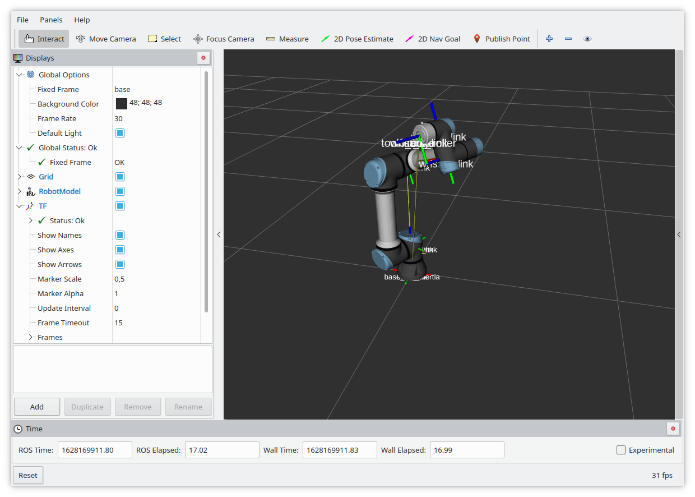
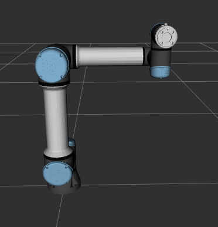
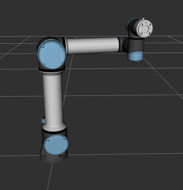
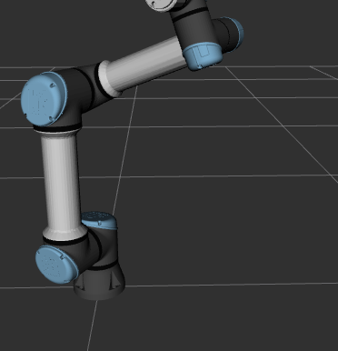
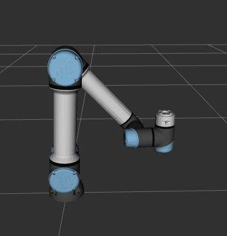
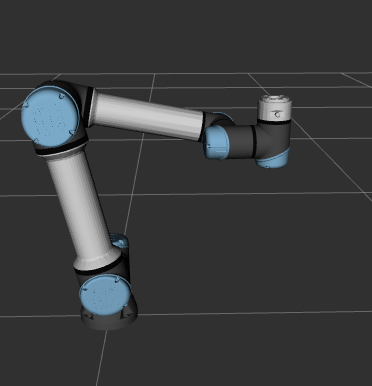
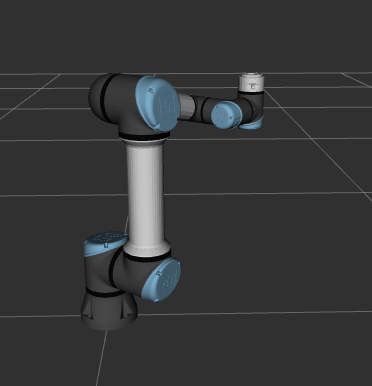
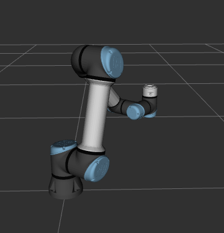

# Using the ur_robot_driver

This tutorial should help you getting started to use the `ur_robot_driver` in your application. It
explains how to start the robot driver and how to control the robot either using MoveIt! or a simple
python script.

## Prerequisites
In order to use the driver you will need a working robot to test with. This can be either a real
robot, connected with an ethernet cable to your ROS machine, or it can be a simulated robot using
URSim.

In this tutorial we assume the following IP settings:

| Machine     | IP address     |
|-------------|----------------|
| Robot / VM  | 192.168.56.101 |
| ROS machine | 192.168.56.1   |

If your setup is different, modify the IP addresses in the following sections accordingly.

Furthermore, we will assume that you already [built](https://github.com/UniversalRobots/Universal_Robots_ROS_Driver#building) the driver successfully and sourced your
workspace containing the built driver.

For this tutorial we will also skip using a calibrated robot description. See the [main setup
guide](https://github.com/UniversalRobots/Universal_Robots_ROS_Driver/blob/master/README.md#extract-calibration-information)

on how to do that.

### Real robot
If you have a real robot and want to use it for testing, make sure it is connected to the ROS
machine on which you'd like to run the driver. We recommend a direct connection between the robot
and the control PC so that other network participants will not disturb the network traffic. Make
sure that the network is configured, such that both, the robot and the ROS machine are in the same
subnet. See the robot's user manual how to setup a static IP address on the robot.

### Using a simulated robot
For simulation we recommend running URSim in a virtual machine. You can directly download a virtual
machine image containing a preconfigured URSim from Universal Robot's [download
page](https://www.universal-robots.com/download/?filters[]=98759&query=). Please note, that you will
have to select "**Non-Linux Offline simulator**" in order to get the virtual machine.

The following will assume that you have VirtualBox installed on your machine. If not, you can
install it by calling `sudo apt install virtualbox` in a terminal.

Once downloaded, extract the archive and open the file `URSim_VIRTUAL-<version>.vbox`. It should
right open in VirtualBox,

#### Network setup
Next, setup a host network that will be used for the machine.

For this, click **File** > **Host Network Manager**. A dialog will open in which you can click the
**create** button which will add an entry to the list. It should automatically get the static IP
address `192.168.56.1`. If not, set it up manually in the dialog. Once done, you can close the
dialog again to go back to your VirtualBox main window. There, select the URSim_VIRTUAL... machine
and click on **Settings**. Select the **Network** point in the list on the left and activate at
least one network adapter, setting the **Attached to** dropdown menu to **Host-only Adapter**.
Select the network you just created, if there are multiple host-only networks available. Click on
the **ok** button to close the dialog and go back to your main window.

As a side note: A host-only network is not the only option to get this running, but it is the
easiest. If you consider using another networking mode, make sure that the virtual machine is
reachable via its on IP address from the host machine and that it can reach the host machine, as
well.

#### Starting a robot
To start a simulated robot, select your URSim virtual machine and clock on the **Start button**. The
machine should boot and finally present a desktop with a shortcut for every robot model. Simply
double click on the robot model that you want to use for testing. No further network setup for the
simulated robot is necessary.

In this tutorial we will assume that you start a UR5 robot from a URSim version > 5.8.

## Starting the driver and visualizing the robot in RViz
In order to start the driver it is not strictly necessary to install the **External Control** URCap.
If you only want to connect to the robot and visualize the robot in RViz, nothing has to be changed
on the robot. You should, however, make sure that is is running, as otherwise no joint data will be
sent.

To start the driver run the following command in a terminal:

```
roslaunch ur_robot_driver ur5e_bringup.launch robot_ip:=192.168.56.101
```

In another terminal, run

```
roslaunch ur_robot_driver example_rviz.launch
```

This should open up an RViz window showing the robot. Try moving around the robot's joints using the
teach panel and watch how it also moves inside ROS.



## Control the robot
For controlling the robot you'll need a special program running on the robot that will interpret and
execute the commands coming from ROS. This can be either done by installing the **External Control**
URCap as explained
[here](https://github.com/UniversalRobots/Universal_Robots_ROS_Driver/blob/master/README.md#setting-up-a-ur-robot-for-ur_robot_driver)
or by using the [headless
mode](https://github.com/UniversalRobots/Universal_Robots_ROS_Driver/blob/master/ur_robot_driver/README.md#headless-mode).
We assume the use of the URCap in the following.

Before any control of the robot can happen, a program containing the **External Control** program
node must be running on the robot. You should see the output `Robot ready to receive control
commands.` in the terminal where you launched the driver. See [this troubleshooting
entry](https://github.com/UniversalRobots/Universal_Robots_ROS_Driver/blob/master/README.md#i-started-everything-but-i-cannot-control-the-robot)
if you experience problems in this step.

### Control the robot using the `test_move` script
Once you've setup the robot for getting controlled by ROS, you can move it around using the
[`test_move`](https://github.com/UniversalRobots/Universal_Robots_ROS_Driver/blob/master/ur_robot_driver/scripts/test_move) script.

Start the driver and an RViz window as before. Then, in a third terminal run

```
rosrun ur_robot_driver tes_move
```

This script will guide you through the different trajectory controllers available. For informations
about the different controllers, please see [TODO: Change once merged #423](https://github.com/UniversalRobots/Universal_Robots_ROS_Driver/pull/423).

It will first ask about the controller to be used:

```
Available trajectory controllers:
0 (joint-based): scaled_pos_joint_traj_controller
1 (joint-based): scaled_vel_joint_traj_controller
2 (joint-based): pos_joint_traj_controller
3 (joint-based): vel_joint_traj_controller
4 (joint-based): forward_joint_traj_controller
5 (Cartesian): pose_based_cartesian_traj_controller
6 (Cartesian): joint_based_cartesian_traj_controller
7 (Cartesian): forward_cartesian_traj_controller
Please choose a controller by entering its number (Enter '0' if you are unsure / don't care): 0
```

After that, you'll have to confirm that the motions the robot is about to make, can safely be
executed the way your robot is mounted. If you're running a simulated robot, you can confirm this
without thinking twice. However, if a real robot is connected, please make sure that the robot is
actually free of any obstacles inside the space where the motion is taking place. See the images
below for a visualization of the setpoints:

**Joint-based motions**: (The cable leaving the base to the back on an e-Series robot)




**Cartesian motions**: (The cable leaving the base to the back on an e-Series robot)
**Please note: Depending on your starting configuration there might also be a valid elbow-down
configuration for each of the poses!**







You can play around by changing the trajectories inside the python code, if you like. You can also
setup velocities in each waypoint to get a smooth motion through all waypoints.

### Control the robot using MoveIt!
to be written...

